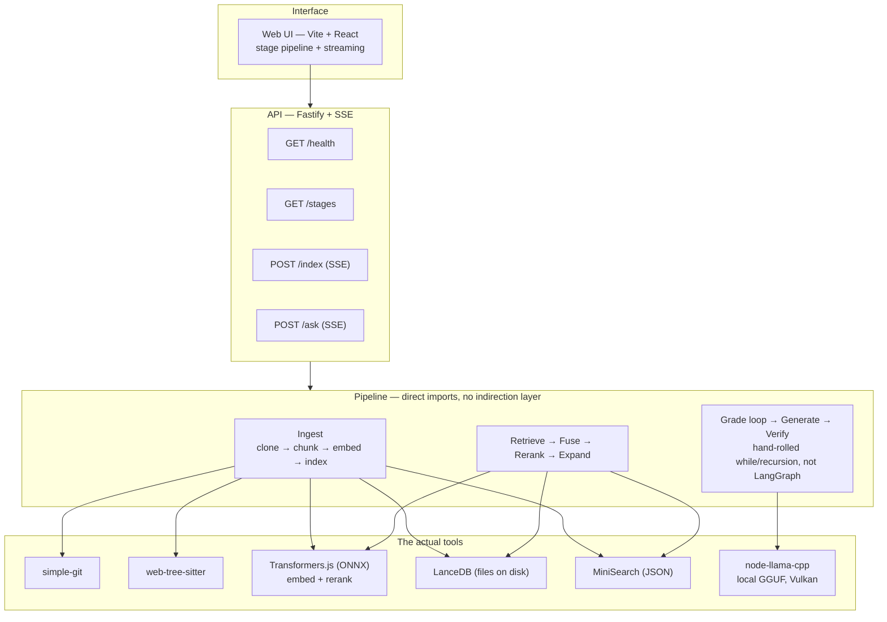
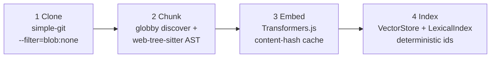
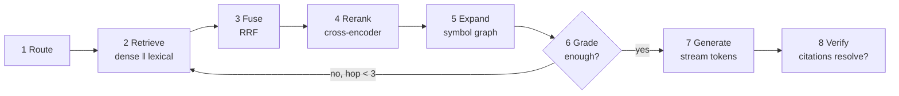

# Architecture

This document is the system map: the component diagram, the two pipelines (ingest and
query), the data model, and what was originally planned but not built (stated honestly,
not hidden — see each section's own callout).

> Every tool named here has a row in [`DECISIONS.md`](./DECISIONS.md) explaining why it
> was chosen and what was rejected. This document says _what_; DECISIONS.md says _why_.

---

## 1. Component overview



**What actually happens:** the API's route handlers are thin wrappers (`src/api/server.ts`)
around two framework-agnostic functions (`index-stream.ts`, `ask-stream.ts`) that call the
pipeline stages directly — `cloneRepo` → `chunkRepo` → `embedChunks` → `indexRepo`, and
`answerQuestion` (which runs Route through Verify). No CLI, no message queue, no ports
layer, no separate orchestration framework. Dev scripts under `src/scripts/` (`npm run
clone`, `npm run ask`, etc.) call the exact same stage functions directly, one per stage —
useful for testing a single stage in isolation, not a product surface (see `CLAUDE.md`).

**Planned but not built** (each has a fuller note in its own section below): a CLI, a
LangGraph-based agent (the query loop is a hand-rolled `while`/recursive loop instead —
[DECISIONS #0006](./DECISIONS.md) explains why, including the honest caveat that a
hand-rolled loop can be the right call), a ports-and-adapters/container abstraction with 6
swappable interfaces, and wired Qdrant/Ollama adapters (documented as the intended managed
swap in `DECISIONS.md`, but no code currently implements or tests against them — swapping
today means editing the one file that does the thing, e.g. `embedder.ts` or `llm.ts`, not
flipping an env var).

---

## 2. Ingest pipeline (offline)

> **As actually built**, this is 4 stages, not 6 — the diagram and table below describe the real
> pipeline. An earlier draft of this doc planned a separate SQLite-backed "Symbols" stage and an
> LLM-generated one-line summary per chunk; neither was built. The symbol/call graph that stage
> would have produced is instead built **in memory, at query time**, inside Expand (stage 5 of the
> query pipeline) — see [`05-expand/README.md`](../src/pipeline/query/05-expand/README.md), which
> is explicit that it's a name-based scan, "not a real call graph."



| #   | Stage | What it produces                   | Key detail                                                                                  |
| --- | ----- | ---------------------------------- | ------------------------------------------------------------------------------------------- |
| 1   | Clone | Local working copy + full history  | Partial clone (`--filter=blob:none`) keeps history without every blob                       |
| 2   | Chunk | Discovered files + AST chunks      | Discover honours `.gitignore`, skips binaries/lockfiles; tree-sitter keeps a function whole |
| 3   | Embed | A vector per chunk                 | Content-hash cache → unchanged chunks are never re-embedded                                 |
| 4   | Index | Populated vector + lexical indexes | Deterministic ids make re-indexing idempotent (upsert, not append)                          |

### Incremental re-indexing — planned, not implemented

Re-indexing an already-cloned repo today runs a **full rescan**: `discoverFiles` walks every file
again, not a `git diff` against what was indexed last time. Two things make this cheap rather than
slow — deterministic chunk ids (re-upserting the same content is a no-op, not a duplicate) and
the embed cache above — but it is not the git-diff-based, changed-files-only design once planned
(track `indexed_commit_sha` + a manifest, diff on re-index, `deleteByFile` for removals). That
design is real future work, not current behavior; nothing in this repo polls or receives push
notifications for upstream changes — re-indexing only happens when something explicitly calls
`/index` again. See the "Also not implemented" note in [`DECISIONS.md`](./DECISIONS.md) for the
full picture, including a real, still-open bug in the cached-clone reuse path.

---

## 3. Query pipeline (online) — the 8 stages the UI renders



| #   | Stage    | Role                                               | Tool                                  | ADR                    |
| --- | -------- | -------------------------------------------------- | ------------------------------------- | ---------------------- |
| 1   | Route    | Classify: symbol / concept / trace / manifest      | heuristics, no LLM call               | —                      |
| 2   | Retrieve | Dense (vectors) **and** lexical (BM25) in parallel | LanceDB + MiniSearch                  | [0004](./DECISIONS.md) |
| 3   | Fuse     | Merge the two ranked lists                         | Reciprocal Rank Fusion                | [0004](./DECISIONS.md) |
| 4   | Rerank   | Score (query, chunk) pairs together; 50 → 8        | cross-encoder (Transformers.js)       | [0005](./DECISIONS.md) |
| 5   | Expand   | Add callers/callees via a name-based symbol scan   | in-memory symbol graph                | —                      |
| 6   | Grade    | "Do I have enough to answer?"                      | hand-rolled hop loop                  | [0006](./DECISIONS.md) |
| 7   | Generate | Stream a cited answer                              | `node-llama-cpp` (local GGUF, Vulkan) | [0008](./DECISIONS.md) |
| 8   | Verify   | Every cited `file:line` must resolve               | pure code                             | [0010](./DECISIONS.md) |

**Stage 6 looping back to stage 2 is the reason a plain LCEL chain wouldn't work** — a DAG
can't express "loop back to retrieve with what this hop learned." What's actually running
is a hand-rolled `while`/recursion loop (`src/pipeline/query/06-grade/query-loop.ts`), not
LangGraph — [DECISIONS #0006](./DECISIONS.md) has the full argument for why a cycle needs
more than a DAG, and its own honest caveat: since this loop rarely exceeds one or two hops
in practice, hand-rolling it was the right call over pulling in LangGraph's checkpointing
machinery for a loop this small — that tradeoff should be revisited if the loop ever gets
materially more complex.

`stages.manifest.ts` is the one real source of stage metadata (id, title, summary, doc
path, tool, status) — it feeds both the `/stages` API route and this doc's own tables.
[`PIPELINE.md`](./PIPELINE.md) is a separate, still-unbuilt idea (an auto-generated
per-stage doc with hover-card-style explanations) — it currently says so itself rather
than pretending to be current.

---

## 4. Ports & adapters — planned, not built

The original plan called for 6 swappable interfaces (`EmbeddingProvider`, `VectorStore`,
`LexicalIndex`, `Reranker`, `LLMProvider`, `JobQueue`), each with an embedded and a service
adapter, wired through a `container.ts` with an `APP_MODE` env-driven preset. **None of
this exists.** There is no `ports.ts`, no `container.ts`, no `Filter` DSL, no `APP_MODE`.
Every stage imports its concrete tool directly — `04-index/vector-store.ts` calls LanceDB
directly, `07-generate/llm.ts` calls `node-llama-cpp` directly, and so on.

This is a legitimate simplification for a project this size, not an unnoticed gap — see
[DECISIONS.md](./DECISIONS.md)'s note that `#0009` (ports & adapters) should be marked
historical rather than left implying code that doesn't exist. **What swapping actually
looks like today:** open the one file that owns the concrete tool (e.g. `embedder.ts` to
change the embedding model, `llm.ts` to point at a hosted OpenAI-compatible endpoint
instead of the local GGUF) and edit it directly — a real code change, not a config flip.
[DECISIONS.md](./DECISIONS.md) documents, per layer, what a managed alternative would be
(Qdrant, Ollama/Groq/vLLM, HF TEI, Langfuse) even though none of them are wired up or
tested against right now.

---

## 5. Data model

The chunk is the atom of the system. Its metadata is what makes filtering and citations
work. This is the real interface (`src/core/types.ts`), not the originally planned one —
it has no `imports`/`docstring`/LLM-generated `summary` fields; those were never built.

```ts
interface Chunk {
  id: string; // deterministic — stable across runs so re-indexing upserts, not duplicates
  repoId: string;
  filePath: string; // repo-relative, POSIX-style
  kind: 'code' | 'config' | 'text';
  language?: 'ts' | 'js' | 'python' | 'java' | 'go';
  configFormat?: string; // set when kind === 'config', e.g. 'dockerfile' | 'yaml' | 'json'
  symbolName: string;
  symbolType:
    'function' | 'method' | 'class' | 'interface' | 'enum' | 'record' | 'type' | 'file' | 'block';
  parentSymbol?: string; // enclosing class/namespace, for methods
  startLine: number; // citations come straight from tree-sitter node positions
  endLine: number;
  content: string;
  contentHash: string; // sha256 of content — the embedding cache key
  commitSha?: string; // HEAD commit at index time
}
```

Persisted state after an index run is just the populated `VectorStore` (LanceDB files) and
`LexicalIndex` (a JSON file per repo) on disk under `.cache/`. There is no separate symbol
graph persisted anywhere — Expand rebuilds it in memory, from the same chunks, on every
query — and no `indexed_commit_sha` or file manifest is tracked (see §2's incremental-
indexing note for what that would take to add).

---

## 6. Cost & observability — mostly planned, not built

**What's real:** `docs/COST.md` exists and honestly labels itself a placeholder — it's
meant to be generated from Claude Code's own session transcripts (which already carry
per-turn token usage), but the `cost-report` skill that would generate it hasn't been
written yet.

**What's not built:** there is no runtime tracing (no `.cache/traces/*.jsonl`, no span
written per stage) and no eval harness — `eval/` is an empty directory with only a
`.gitkeep`; the golden question set and the recall@k/MRR/nDCG/citation-resolution scripts
described in the original plan don't exist. Each stage's own README instead documents
correctness with real, captured example runs against the standard test repo — a weaker
substitute for a real eval suite, but real rather than aspirational.
